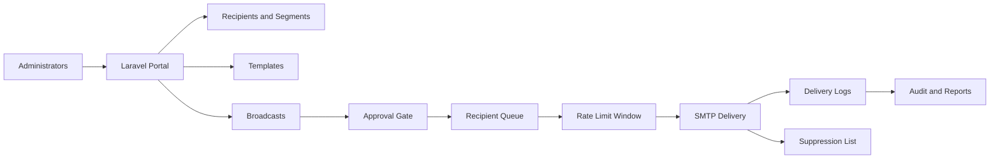

# Laravel Email Distribution Portal

A secure Laravel and MySQL platform for scheduled email distribution, recipient segmentation, throttled SMTP delivery, queue recovery, compliance evidence, and deliverability governance.

The project is designed for institutional communication teams that need auditable email operations without relying on opaque bulk-mail tooling. It focuses on consent-aware recipient management, rate-limited sending, suppression controls, and operational traceability.

## Core Capabilities

- Laravel 13 application structure targeting PHP 8.3+ and MySQL 8.
- Recipient repository with segmentation, consent state, suppression state, and group membership.
- Broadcast planning workflow with approval gates, scheduled send windows, and template rendering.
- Database-backed queue table for pending recipients, retry attempts, and resume-after-interruption behavior.
- SMTP delivery through Laravel Mail with per-recipient traceability.
- Rate limiting by rolling window, defaulting to 400 recipients per 60 minutes.
- Transaction logs for SMTP status, response codes, latency, message identifiers, and failure reasons.
- Deliverability governance for SPF, DKIM, DMARC, bounce handling, and suppression-list hygiene.
- MFA-aware administrative route protection and audit logging for privileged actions.
- Laravel scheduler commands for cron-driven dispatch every 30 or 60 minutes.
- Security-first deployment guidance with TLS, secret management, database indexing, and queue worker controls.

## Architecture



## Laravel Scheduler

Register the Laravel scheduler in cron:

```bash
* * * * * cd /var/www/laravel-email-distribution-portal && php artisan schedule:run >> /dev/null 2>&1
```

The scheduler triggers:

- `mail:dispatch-due-broadcasts` every minute to identify approved scheduled campaigns.
- `mail:send-broadcast-batch` every 30 minutes by default to send up to the configured threshold.
- `mail:deliverability-snapshot` hourly to capture DNS and reputation evidence.

## Rate Limiting

Default environment values:

```env
BROADCAST_BATCH_LIMIT=400
BROADCAST_WINDOW_MINUTES=60
```

The batch sender asks the database how many successful deliveries were recorded within the active window, then only sends the remaining allowance. This avoids relying on memory counters and allows safe recovery after process interruption.

## Local Installation

```bash
composer install
cp .env.example .env
php artisan key:generate
php artisan migrate --seed
php artisan serve --port=8088
```

Run the queue worker:

```bash
php artisan queue:work --queue=mail,default --tries=3 --timeout=120
```

Run tests:

```bash
php artisan test
```

## Security Posture

- Administrative routes are protected with authentication, MFA middleware, and audit logging.
- SMTP credentials stay in environment variables or a secret manager.
- Session cookies are encrypted, secure, HTTP-only, and SameSite strict in production.
- Broadcast approval is required by default before queueing recipients.
- Suppressed recipients, bounced addresses, and unsubscribed addresses are excluded from queue preparation.
- Database constraints and indexes protect high-volume query paths.
- Every broadcast is linked to a user account for accountability.

## Documentation

- [Architecture](docs/ARCHITECTURE.md)
- [Security Controls](docs/SECURITY.md)
- [Deliverability](docs/DELIVERABILITY.md)
- [Operations Runbook](docs/OPERATIONS.md)
- [Deployment](docs/DEPLOYMENT.md)
- [Data Model](docs/DATA_MODEL.md)

## Professional Profile

Maintained as part of the professional portfolio of [Musaab Hasan](https://musaab.info), focused on secure platforms, cybersecurity governance, business continuity, digital transformation, and responsible technology operations.

## License

MIT
