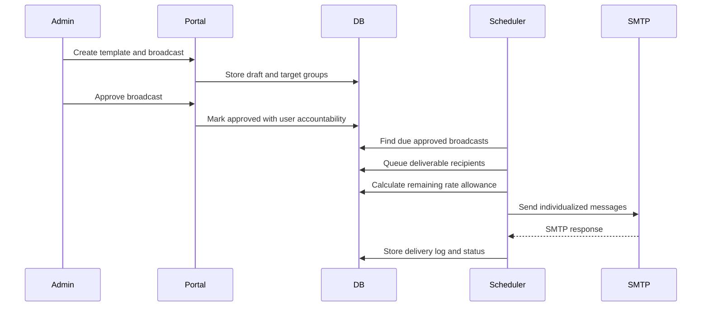

# Architecture

## System Goals

The portal is built for controlled email distribution where every message can be traced to a user, template, recipient segment, delivery attempt, SMTP outcome, and compliance decision.

## Components

- Laravel web portal: manages recipients, segments, templates, broadcasts, approvals, and reports.
- MySQL database: stores recipients, group membership, broadcast queues, logs, audit records, and deliverability snapshots.
- Laravel Mail: sends through an approved SMTP relay using TLS.
- Laravel scheduler: triggers due-broadcast dispatch and throttled batch sending from cron.
- Database queue records: make delivery resumable after interruption.
- Suppression list: prevents sending to unsubscribed, bounced, blocked, or administratively suppressed addresses.

## Delivery Flow

## Why Individual Recipient Delivery

The platform does not default to large BCC-based dispatch because individualized recipient delivery provides:

- Better traceability.
- Cleaner unsubscribe handling.
- Better bounce attribution.
- Safer personalization.
- Easier retry and suppression controls.

## High-Volume Data Paths

The migrations include indexes for:

- Recipient deliverability flags.
- Broadcast status and schedule windows.
- Pending broadcast recipients by status, availability, and attempts.
- Delivery logs by broadcast, status, and sent timestamp.
- Sessions, jobs, audit events, and deliverability snapshots.

## Extension Points

- Add import pipelines for CSV, SIS, CRM, or HR datasets.
- Add webhook endpoints for SMTP provider bounces and complaints.
- Add policy approvals for high-volume or sensitive broadcasts.
- Add per-domain throttling for multi-domain sender pools.
- Add analytics exports for institutional reporting.
