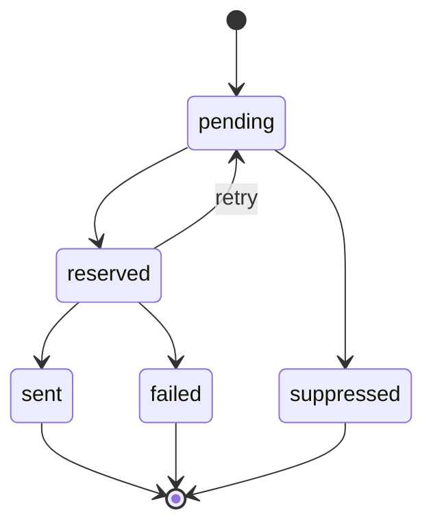

# Data Model

## Main Tables

- `users`: administrators, operators, approvers, and MFA state.
- `recipients`: consent-aware recipient records.
- `recipient_groups`: static or dynamic recipient segments.
- `recipient_group_recipient`: recipient segment membership.
- `email_templates`: HTML and text message templates with variable inventory.
- `broadcasts`: scheduled communication campaigns.
- `broadcast_recipient_group`: target group membership for each broadcast.
- `broadcast_recipients`: per-recipient queue rows.
- `delivery_logs`: SMTP responses, status, timing, and message identifiers.
- `suppressions`: unsubscribe, bounce, complaint, and administrative suppression state.
- `audit_events`: administrative traceability.
- `deliverability_snapshots`: SPF, DKIM, and DMARC evidence over time.

## Queue States

## Indexing Strategy

- `recipients_deliverable_idx` supports deliverable-recipient filtering.
- `broadcasts_status_schedule_idx` supports due-broadcast discovery.
- `broadcast_recipients_send_idx` supports batch selection by status and availability.
- `delivery_logs_broadcast_status_idx` supports reporting and rate-limit queries.
