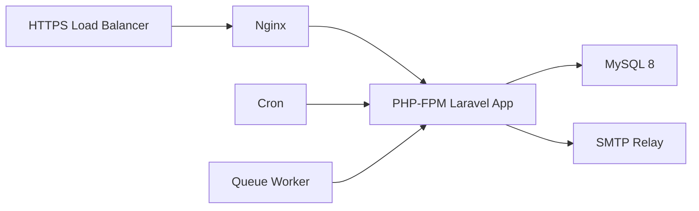

# Deployment

## Runtime Requirements

- PHP 8.3+
- MySQL 8.0+
- Nginx or Apache with HTTPS
- Approved SMTP relay
- Cron
- Process manager for queue workers

## Recommended Production Topology



## Data Residency

Deploy the application, database, backups, logs, and SMTP routing inside approved institutional or regional infrastructure. Document the selected region, hosting provider, backup location, and authorized administrators before production use.

## Deployment Steps

```bash
composer install --no-dev --optimize-autoloader
cp .env.example .env
php artisan key:generate
php artisan migrate --force
php artisan config:cache
php artisan route:cache
php artisan view:cache
```

## Web Server

Point the web root to:

```text
public/
```

Do not expose:

- `.env`
- `storage/`
- `database/`
- `vendor/`
- repository metadata

## Backups

Back up:

- MySQL database.
- `.env` through a secure secret process.
- Storage imports and exports when enabled.
- Audit and delivery logs according to retention rules.
